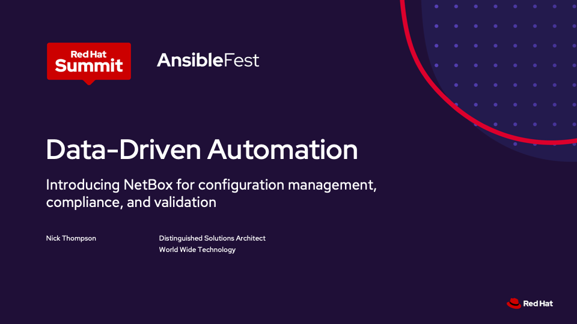

# Data-Driven Automation

## Overview

This repository contains the Ansible Roles, Playbooks, and Rulebooks to support the demonstrations shown during Red Hat Summit in Boston, MA on May 21st, 2025.

### Session Abstract

Data is the foundation for scalable and reliable infrastructure automation, but many organizations struggle with inventory management and data configuration as they work to fully automate their infrastructure lifecycle.

In this session, we introduced NetBox, a solution for modeling and documenting modern networks as a single source of truth for network automation, built on Red Hat Ansible Automation Platform.

We explored this data-centric automation approach with a live demonstration where we automated:

* Device and data onboarding into the NetBox platform using Ansible Automation Platform.
* Day 0 network provisioning.
* Day 2 operations and configuration compliance.
* Automated testing and validation.

## Projects

### `aap-configuration-ansible`

This directory contains the Ansible playbooks and data to populate `AAP-as-code` with the necessary configuration to run the demos from this repository.

### `netbox-ansible`

This directory contains the Ansible roles, playbooks, and data to populate a NetBox instance with the data required to run the demonstration.  This automation has been tested against both NetBox Cloud and NetBox Community.

### `netbox-containerlab-ansible`

This directory contains the Ansible roles and playbooks to generate and deploy Containerlab topology files from the topology data in NetBox.

### `network-configuration-ansible`

This directory contains the Ansible roles and playbooks to manage the configuration of the network using the data in NetBox.

### `network-validation-ansible`

This directory contains the Ansible roles and playbooks to validate the current network state against intended state data in NetBox.

### `rulebooks`

This directory contains the Event-Driven Ansible Rulebooks used to trigger automation when NetBox data is updated through the NetBox UI.

## WWT On-Demand Lab

If you are interested in this topic and want to work through a hands-on lab, we have published the [Data-Driven Automation with NetBox Lab](https://www.wwt.com/lab/data-driven-automation-with-netbox) on wwt.com.

In this hands-on lab, learners will explore how to build and configure a data-driven automation workflow using Ansible Automation Platform and NetBox. The lab guides users through practical exercises that demonstrate how real-time source of truth changes can trigger automated configuration. Participants will configure NetBox event rules and webhooks to emit actionable events, set up Event-Driven Ansible event streams to receive and process those events, and create rulebook activations that respond intelligently. By the end of the lab, learners will have a working solution that tightly integrates their source of truth with automation workflows—enabling scalable, responsive infrastructure management.

## Contributors

* Nick Thompson - ([github/@nsthompson](https://github.com/nsthompson))
* Jeff Andiorio - ([github/@jandiorio](https://github.com/jandiorio))
